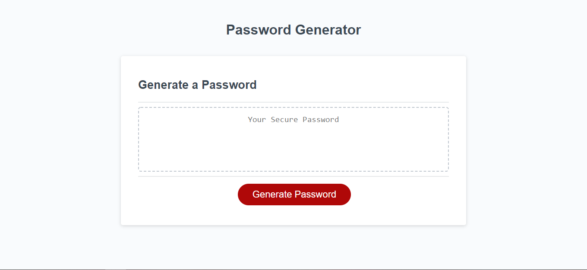
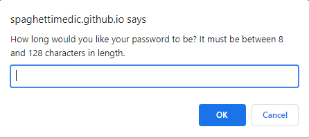
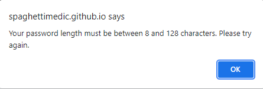
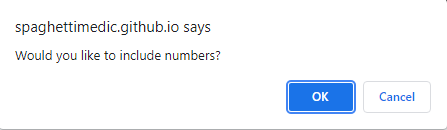
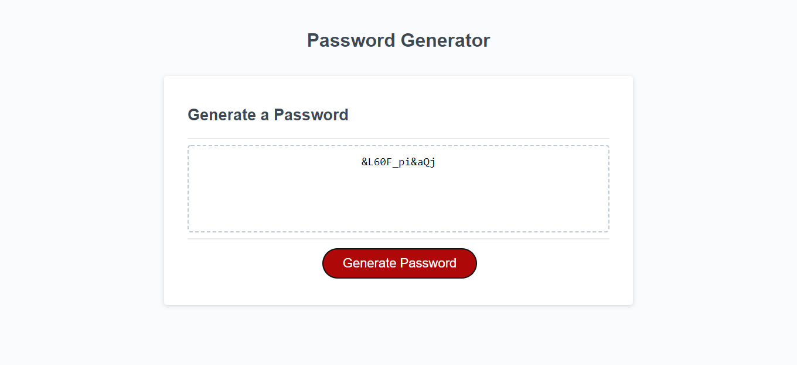

# Password Generator

## Description
Password Generator does just as the names implies; it generates a password. You can choose a password that does or does not have: lower case letters, upper case letters, numbers, and/or symbols.

## Table of Contents
* [Usage](#usage)
* [Contributing](#contributing)
* [Tests](#tests)
* [Questions](#questions)
* [Deployed Application](#deployed-application)

## Usage
Click the "Generate Password" button and then answer the prompts on the screen accordingly. You must choose a password that is between 8 and 128 characters in length. If no length is chosen, or a length that is less than 8, or greater than 128, is chosen, then you will be prompted to choose a valid length. When you have completed all of the prompts, a password will appear on the screen that can be copied to your clipboard.

## Contributing
This is an open source project and as such, please follow the [Contributor Covenant](https://www.contributor-covenant.org/).

## Questions
Check out my GitHub profile [here!](https://www.github.com/spaghettimedic) I can be reached directly at dsteiner247@gmail.com should you have any questions.

## Deployed Application
https://www.spaghettimedic.github.io/passwordGenerator